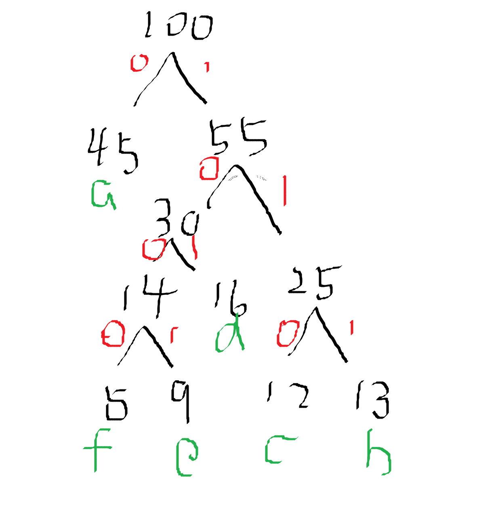

# 二叉树

## 哈夫曼树

- WPL（带权路径长度）的计算：结点权值*路径长度
- 哈夫曼树：最小带权路径长度的二叉树（也称最优树）
- 哈夫曼编码：每次取最小的两个
- 哈夫曼编码：不可能出现一个字符的编码是另一个的前缀

a:000   3
b:100   4
c:001   3
d:01    7
e:11    9
f:101   5

WPL:3*(3+4+3+5)+2*(7+9)

45 + 32=77

a:0
b:111
c:110
d:101
e:1001
f:1000

face:12
1000 0 110 1001

## 扩展

文本压缩算法

- 基于字典得到压缩算法 LZ
- 基于统计的压缩 哈夫曼编码

## 二叉树的遍历

- 先序遍历：根左右
- 后序遍历：左右根
- 中序遍历：左根右
- 层序遍历：

中序BDCAEF
后序DCBAFE
前序EABCDF
