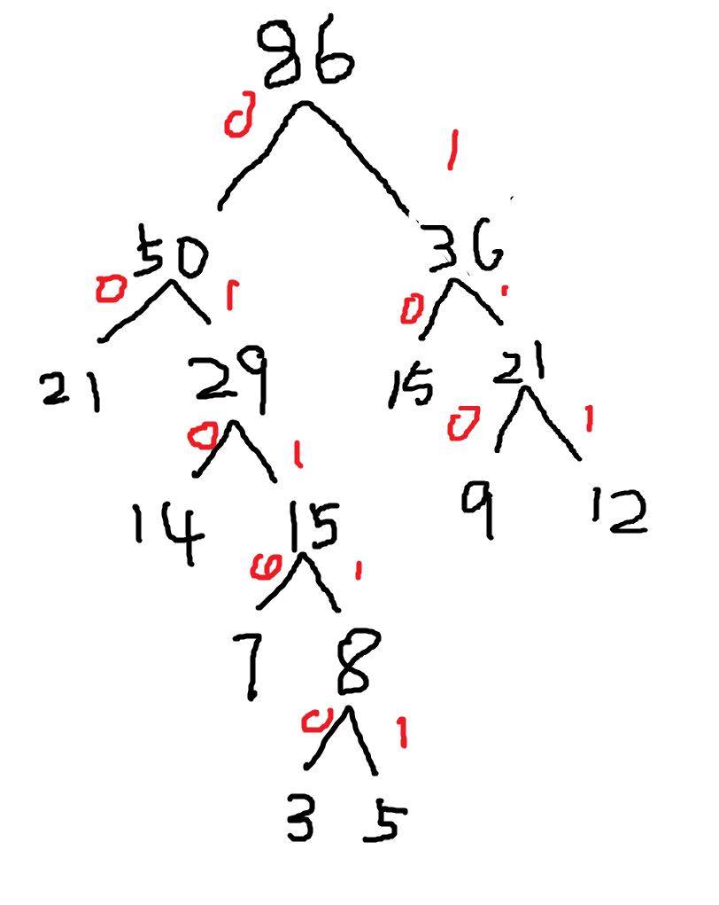

12:111
5:01111
3:01110
7:0110
14:010
21:00
9:110
15:10

WPL:5*(3+5)+4*7+3*(12+14+9)+2*(21+15)=
40+28+105+72=245

后序遍历
ACDBGJKIHFE

先序遍历
ABCDGEIHFJK

2,4,11,18,25,32,39,46,53,60,67,74

# 二叉搜索树

- 左边均小于根，右边均大于根
- 左右子树同样是二叉搜索树
- 二分搜索时间复杂度O（logN）

## 作业

1.完成前序后序层序，最大最小
2.翻转
