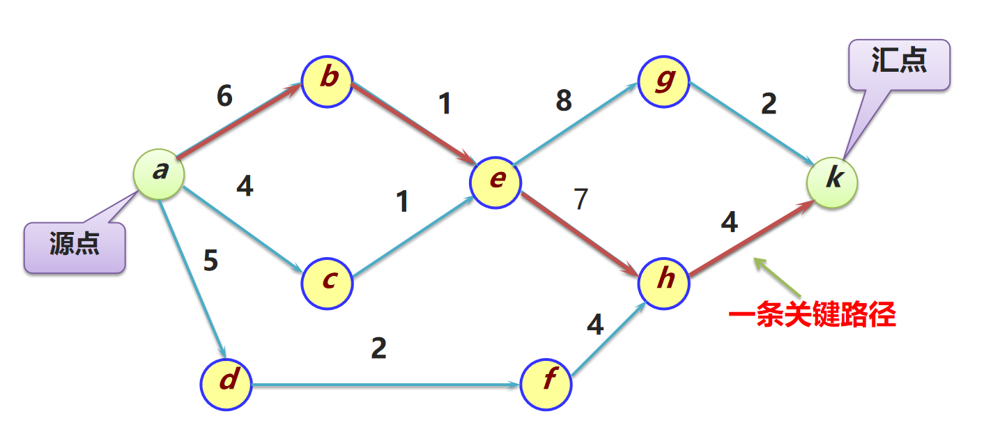

# 图

## AOE网
- 顶点表示事件
- 边表示事件之间的依赖关系
- 边的权重表示事件之间的依赖关系强度
- 关键路径是指从开始事件到结束事件的最长路径，即所有事件的依赖关系中，权重总和最大的路径。
- 
- 关键活动是指关键路径上的顶点，即在关键路径中，权重最大的顶点。

- ee:最早完成时间，正着推选最大的完成时间
- le:最晚完成时间，倒着推选最小的完成时间
    ee      le
v1  0      0
v2  3      6
v3  4      4
v4  5      15
v5  7      7 
v6  9      19
v7  15      19
v8  11      11
v9  21      21
v10  22      22
v11  28      28

- 关键路径：v1 v3 v5  v8 v9 v10 v11

    ee      le
A   0       0
B   6       6
C   4       6
D   5       8
E   7       7
F   16      16
G   14      14
H   7       10
I   18      18

- 关键路径：A B E F G I

## 复习Dijkstra算法

顶点   min   访问    路径
0      0      T      0
1      -      T      NULL
2      10     T      0
3      50     T      4
4      30     T      0
5      60    T      3

0,4,3,5

## Floyd算法
- 多源最短路径（任意两个顶点之间的最短路径）
