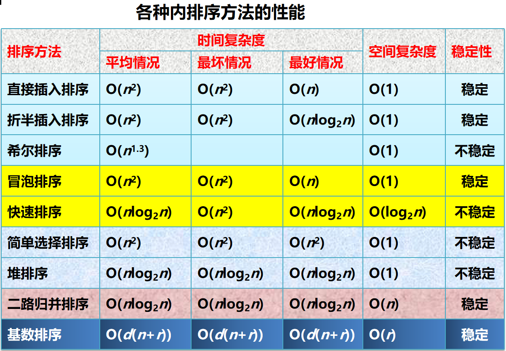

# 查找算法

## 内查找
- 在内存中查找数据

## 外查找
- 在外部存储设备中查找数据

## 动态查找表
- 链表
- 在查找的同时对表进行更新

## 静态查找表
- 顺序表
- 在查找的同时不对表进行更新

## 线性表查找

- 顺序查找
  - 从线性表的头开始，逐个比较每个元素，直到找到目标元素或遍历完整个线性表。
  - 时间复杂度：O(n)
  - ASL成功=(n+1)n/2
  - ASL失败=n
  - 可以使用哨兵k，while循环结束条件为哨兵元素等于目标元素，避免了比较哨兵元素的次数。
    - 例如：while(arr[i] != k) { i++; }  // i=0

- 二分查找（折半查找）
  - 前提：顺序存储的线性表，元素已排序

- 分块查找
  - 通过索引表，快速定位到目标元素所在的块，再在块内进行顺序查找。

## 树表查找
- 二叉排序树
- 平衡二叉树
- 红黑树
- B树
- B+树

## 哈希表查找
- 哈希表（散列表） hash table
- 哈希函数：任意输入，定长的输出；输入确定，输出确定
- 哈希值（存储地址）
- 负载因子
- 哈希冲突
  - 开放定址
    - 线性探测 `*`
    - 平方探测 1 2 4
    - 拉链法

## 排序
- 内排序
  - 基于比较的排序算法
    - 插入排序
      - 分为有序区和无序区，每次将无序区的第一个元素插入到有序区的正确位置
      - 最好情况复杂度：O(n)
      - 最坏情况复杂度：O(n^2)

      - 希尔排序：将数据基于间隔进行两两分组，直到间隔为1，最后进行一次插入排序
        - O(n^1.3)
    - 折半插入排序
      - 分为有序区和无序区，每次插入时，都需要折半查找有序区的正确位置
    
    - 冒泡排序
      - 每次两两交换，如果有一次没有任何数据交换，提前结束排序
      - 最好情况复杂度：O(n)
      - 最坏情况复杂度：O(n^2)
    - 快速排序
      - 选择一个基准（可优化，选择3个值取中间值）
      - 通过左右指针，分为左右两个子数组，左子数组小于等于基准，右子数组大于基准
      -    L
      - 20 15 14 18 36 40 10 21
      - 0   1  2  3  4  5  6  7
      -                       R
      - 例如：基准=20，左子数组=15 14 18，右子数组=36 40 10 21
      - 当L，R相遇，交换L，R指向的元素的前一个，将基准放到正确位置
      - 第一趟：10 15 14 18 20 40 36 21
      - 递归排序左子数组和右子数组
      - 最好情况复杂度：O(nlogn)
      - 最坏情况复杂度：O(n^2)
    - 选择排序
      - 每次从无序区选择最小的元素，交换到有序区的末尾
      - 比较次数：1+2+3+...+n-1
      - 最好情况复杂度：O(n^2)
      - 最坏情况复杂度：O(n^2)
    - 堆排序
      - 建立一个大根堆，将数组转换为大根堆
      - 每次将堆顶元素与最后一个元素交换，将堆的大小减1
      - 重复以上步骤，直到堆为空
      - 最好情况复杂度：O(nlogn)
      - 最坏情况复杂度：O(nlogn)
    - 归并排序
      - 将数组分为两个子数组，递归排序每个子数组，最后合并两个有序的子数组
      - 最好情况复杂度：O(nlogn)
      - 最坏情况复杂度：O(nlogn)
  - 不基于比较的排序算法
    - 基数排序：按照元素的位数进行多次排序，每次排序一个位数
      - 时间复杂度：O(d(n+r))
- 