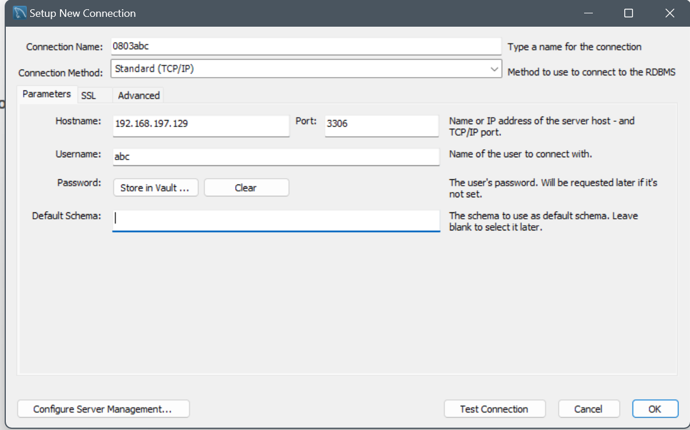

# 网络编程

## HTTP 服务

- HTTP超文本传输协议 HTML 超文本标记语言
  - HTTP 1.0 通过TCP
  - **HTTP 2.0**使用最广泛，通过TCP
  - HTTP 3.0 通过UDP

- 1990 出现HTML HTTP Tim
- 超文本包含
  - 超链接：构成了一个graph 网
  - 图片
  - 音频
  - 视频
- PageRank算法
  - 一个网页被越多其他网页链接（反向链接越多），它就越重要。
  - 一个网页被越重要的网页链接，它本身也越重要。

### HTTP 服务器

- apache
- nginx

### nginx

- 轻量级、高性能 HTTP 服务器 + 反向代理
- 安装: `sudo apt install nginx`
- 查看进程: `ps -ef | grep nginx`
- 查看状态: `service nginx status`
- 启停: `service nginx start/stop/restart`
- 查看监听端口: `sudo netstat -tpnl | grep nginx`
- 配置文件: `/etc/nginx/nginx.conf`
- 默认站点: `/etc/nginx/sites-available/default`
- 文件位置：`/var/www/html`
- 访问: `http://127.0.0.1` (本地) 或 `http://IP` (局域网，用 `ip a` 查IP)

### HTTP协议

- 浏览器：通过GET等命令获取，可能不只有一个GET请求，而是多个
- 使用html：

```html
<!DOCTYPE html>
<html lang="en">
  <head>
    <meta charset="UTF-8" />
    <meta name="viewport" content="width=device-width, initial-scale=1.0" />
    <title>HTTP服务器</title>
    <style>
      h1 {
        text-align: center;
        font-weight: normal;
        color: #ffdfdf;
        background-color: #f74e4e;
      }
      img {
        border-radius: 40%;

        border: 5px solid #f74e4e;
      }
    </style>
  </head>
  <body>
    <h1>主标题</h1>
    <p>
      仓库：一个文件夹，被初始化后，由git托管<a href="http://baidu.com">百度</a>
      - 干净状态：没有未提交的文件，也没有未追踪的文件。 -
      未追踪状态：文件没有放在缓冲区，文件不在git仓库中，也没有被git跟踪。 -
      待提交状态：文件已被修改，但未被提交到git仓库。 -
      待同步状态：文件已被提交到git仓库，但未被同步到远程仓库。。
    </p>
    
    <audio src="我的鹦鹉.mp4" controls autoplay loop></audio>
    <video src="我的鹦鹉.mp4" controls width="900px" height="900px"></video>
  </body>
</html>
```

- 请求中包含文件后缀名，响应时，确定文件类型
- 可通过本地浏览器例如192.168.197.129:\ntest\CCC.pdf直接访问文件

## redis 服务
