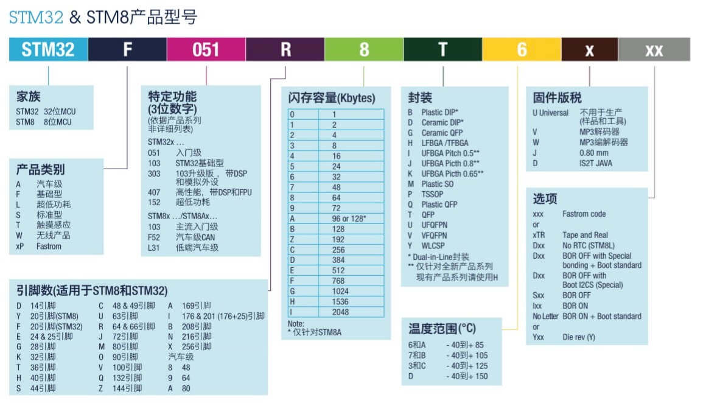

# STM32 初识

> 2026.6.25

---

## 术语解释

| 术语 | 全称 | 说明 |
|------|------|------|
| MPU | Memory Protection Unit | 内存保护单元，用于保护内存区域不被非法访问 |
| MCU | Microcontroller Unit | 微控制器，集成了 CPU + 存储器 + 外设的单芯片系统 |
| DSP | Digital Signal Processor | 数字信号处理器，擅长快速完成乘加运算（MAC），常用于音频、图像、通信等信号处理场景 |
| FPU | Floating Point Unit | 浮点运算单元，硬件加速浮点数计算 |
| QFP | Quad Flat Package | 四侧引脚扁平封装，芯片的物理封装形式 |

---

## STM32 介绍

- STM32 是**意法半导体（STMicroelectronics）**推出的基于 **ARM Cortex-M 内核**的 32 位微控制器
- 命名中 "M" 指的就是 **Cortex-M** 系列内核

### ARM 处理器三大系列

| 系列 | 定位 | 典型应用 |
|------|------|----------|
| Cortex-A | 高性能、多媒体 | 手机、平板，跑 Linux/Android |
| Cortex-R | 高实时性、高可靠性 | 汽车电子、工业控制 |
| Cortex-M | 低功耗、低成本 | 单片机、物联网、传感器节点 |

---

## STM32 芯片选型命名规则

### 示例：STM32F407ZGT6

| 字段 | 含义 | 详解 |
|------|------|------|
| **F** | 基础型 | 通用高性能系列 |
| **407** | 子型号 | 带 DSP 指令 + FPU（硬件浮点） |
| **Z** | 闪存容量 | 1024 KBytes = 1 MB |
| **G** | 引脚数 | 144 引脚（LQFP 封装） |
| **T** | 封装类型 | LQFP（薄型四侧引脚扁平封装） |
| **6** | 温度范围 | -40°C ~ +85°C（工业级） |

---

## 学习思路

1. **基础知识**：了解 STM32F4 系列架构特性，巩固电子原理、嵌入式系统概念和 C 语言
2. **开发工具**：掌握 Keil MDK 的安装、配置与使用
3. **编程语言**：C 语言（STM32 开发主流语言）
4. **官方文档**：阅读《Cortex-M3 权威指南》、STM32 参考手册、数据手册
5. **实践驱动**：通过项目练习加深理解，从点灯开始逐步深入
